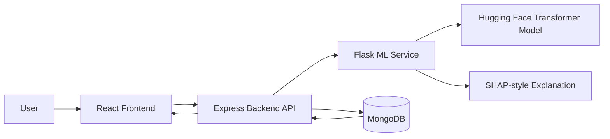
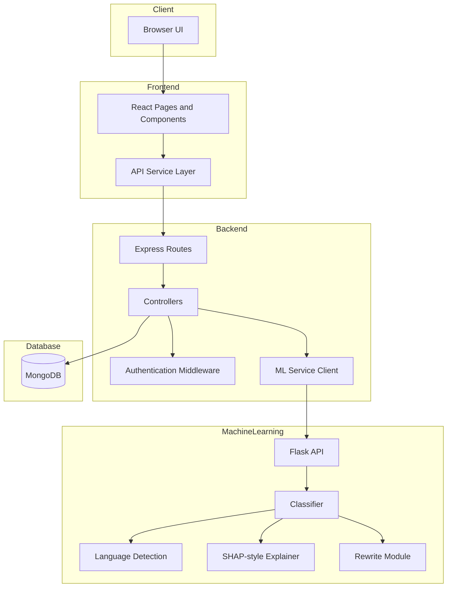

# Explainable Multilingual Hate Speech Detection Platform

## Project Report

Submitted by: `[Your Name]`  
Roll No.: `[Your Roll Number]`  
Course / Branch: `[Your Course / Branch]`  
Institution: `[Your College / University Name]`  
Academic Year: `2025-2026`

Submitted in partial fulfillment of the requirements for the project work.

---

## Certificate

This is to certify that the project titled **"Explainable Multilingual Hate Speech Detection Platform"** has been successfully completed by `[Your Name]` under the guidance of `[Guide Name]`. The project work demonstrates the design and implementation of a full-stack artificial intelligence based web application for detecting hate speech, toxic content, offensive language, threats, and cyberbullying in multilingual text.

---

## Acknowledgement

I express my sincere gratitude to my guide, faculty members, and institution for their support and encouragement throughout the development of this project. I am also thankful to the open-source community for providing frameworks and libraries such as React, Express, Flask, MongoDB, Hugging Face Transformers, PyTorch, and SHAP, which helped in building this system.

---

## Abstract

The rapid growth of online communication has increased the need for automatic moderation systems that can detect harmful content quickly and accurately. Hate speech, toxicity, offensive language, threats, and cyberbullying can negatively affect online communities and create unsafe digital spaces.

This project, **Explainable Multilingual Hate Speech Detection Platform**, is a full-stack AI-based web application designed to analyze user-provided text and identify harmful content. The system supports English, Hindi, and Hinglish-style text. It provides not only a final prediction but also confidence scores, category-wise risk scores, toxic word highlights, language detection, SHAP-style token explanations, and safer rewrite suggestions.

The platform is built using React for the frontend, Node.js and Express for the backend API, MongoDB for persistent storage, and a Python Flask machine learning service powered by Hugging Face Transformers and PyTorch. The system also includes authentication, analysis history, CSV/TXT bulk upload, dashboard analytics, and secure API handling.

---

## Table of Contents

1. Introduction
2. Problem Statement
3. Objectives
4. Scope of the Project
5. Existing System
6. Proposed System
7. Technology Stack
8. System Architecture
9. Module Description
10. Database Design
11. Machine Learning Methodology
12. API Design
13. Implementation Details
14. Testing
15. Advantages
16. Limitations
17. Future Scope
18. Conclusion
19. References

---

## 1. Introduction

Online platforms receive a large amount of user-generated content every day. Manual moderation is difficult, time-consuming, and often inconsistent when the content volume is high. Automated hate speech detection systems help reduce this burden by identifying harmful language and supporting moderation decisions.

However, many detection systems only return a label such as toxic or non-toxic. This is not always sufficient for real-world usage because moderators and users need to understand why a statement was flagged. Explainability improves trust by showing which words or phrases contributed to the prediction.

This project focuses on creating a practical, explainable, and user-friendly moderation platform. It allows users to analyze single text inputs, upload text files for batch analysis, view previous analysis records, and monitor moderation statistics through a dashboard.

---

## 2. Problem Statement

The problem addressed by this project is the detection and explanation of harmful online text content. Social media comments, forum posts, chat messages, and user feedback may contain hate speech, threats, abusive language, or cyberbullying. A reliable system is required to classify such text and present the result in a way that is understandable to users.

The system must:

- Detect toxic, offensive, hate speech, threat, and cyberbullying content.
- Support multilingual and Hinglish-style text.
- Provide confidence and category-wise scores.
- Highlight toxic words and important tokens.
- Suggest a respectful rewrite for harmful statements.
- Store user analysis history securely.
- Present dashboard analytics for moderation insights.

---

## 3. Objectives

The main objectives of the project are:

- To build a web-based hate speech detection platform.
- To integrate a machine learning model for text classification.
- To provide explainable AI output using token-level explanations.
- To support real-time text analysis and file-based batch analysis.
- To implement secure user authentication using JWT and HTTP-only cookies.
- To save analysis records in MongoDB for future reference.
- To display dashboard statistics such as toxic percentage, threat count, language distribution, category distribution, trends, and frequent toxic words.
- To generate safer rewrite suggestions for harmful text.

---

## 4. Scope of the Project

The project can be used as a moderation assistant for websites, educational platforms, online communities, and social media management tools. It is designed as a full-stack system with separate frontend, backend, and machine learning service layers.

The current scope includes:

- Single text analysis.
- CSV and TXT bulk upload.
- User registration and login.
- Analysis history.
- Dashboard visualizations.
- Multilingual language detection.
- SHAP-style explainability.
- Local rule-based safer rewrite generation.

---

## 5. Existing System

Traditional moderation systems often depend on manual review or keyword-based filtering. Manual review is accurate in many cases but slow and expensive. Keyword filtering is fast but can produce false positives and false negatives because it does not understand context.

Some machine learning systems classify text automatically, but many of them only provide a prediction label. Without explanation, users cannot easily understand why a text was marked as harmful.

Limitations of existing systems:

- Lack of explainability.
- Poor handling of multilingual or mixed-language text.
- Limited dashboard analytics.
- No safer rewrite support.
- Difficulty in analyzing bulk content.
- No personalized history for users.

---

## 6. Proposed System

The proposed system is a full-stack AI moderation platform that combines machine learning, rule-based contextual scoring, explainability, and user-friendly visualization.

The user enters text or uploads a file through the React frontend. The backend validates the request and forwards the content to the Flask ML service. The ML service cleans the text, detects language, performs classification, calculates category scores, identifies toxic words, generates token explanations, and returns a safer rewrite. The backend saves results for authenticated users and exposes history and dashboard APIs.

### System Flow



---

## 7. Technology Stack

| Layer | Technologies |
|---|---|
| Frontend | React 19, Vite, Tailwind CSS, Framer Motion, Recharts, Axios, React Router DOM, Lucide React |
| Backend | Node.js, Express 5, Mongoose, JWT, HTTP-only cookies, Helmet, CORS, Rate Limiting |
| Database | MongoDB |
| ML Service | Python, Flask, Hugging Face Transformers, PyTorch, SHAP, NumPy, Pandas, Langdetect |
| File Upload | Multer, CSV Parser |
| Development | npm workspaces, concurrently |

---

## 8. System Architecture

The project follows a three-service architecture:

1. **Frontend Service:** Provides the user interface for authentication, analysis, history, profile, and dashboard.
2. **Backend Service:** Handles authentication, validation, API routing, history storage, file parsing, and communication with the ML service.
3. **ML Service:** Performs text preprocessing, language detection, classification, explanation generation, and safer rewrite creation.

### Architecture Diagram



---

## 9. Module Description

### 9.1 Frontend Module

The frontend is developed using React and Vite. It provides a responsive dashboard-style interface with pages for landing, login, registration, analyzer, history, dashboard, and profile.

Main frontend features:

- Login and registration forms.
- Protected dashboard routes.
- Text analyzer with live preview.
- CSV/TXT file upload for batch analysis.
- Toxicity meter and category progress indicators.
- Highlighted toxic text display.
- Dashboard charts using Recharts.
- Analysis history with search and label filtering.

Important frontend files:

- `frontend/src/pages/AnalyzerPage.jsx`
- `frontend/src/pages/DashboardPage.jsx`
- `frontend/src/pages/HistoryPage.jsx`
- `frontend/src/context/AuthContext.jsx`
- `frontend/src/services/analysisService.js`

### 9.2 Backend Module

The backend is built with Node.js and Express. It acts as the main API layer between the frontend, MongoDB, and the ML service.

Main backend features:

- User signup, login, logout, and current-user API.
- JWT authentication using HTTP-only cookies.
- Optional authentication for analysis requests.
- Input validation using Express Validator.
- File upload handling using Multer.
- CSV/TXT parsing for bulk analysis.
- History and dashboard APIs.
- Security middleware for sanitization, Helmet, CORS, rate limiting, and slow-down protection.

Important backend files:

- `backend/src/app.js`
- `backend/src/controllers/authController.js`
- `backend/src/controllers/analysisController.js`
- `backend/src/controllers/dashboardController.js`
- `backend/src/services/mlService.js`
- `backend/src/models/User.js`
- `backend/src/models/AnalysisHistory.js`

### 9.3 Machine Learning Service Module

The ML service is built with Flask and exposes prediction endpoints. It loads a Hugging Face Transformer model for toxicity classification and combines model predictions with lexicon and contextual scoring.

Main ML service features:

- `/health` endpoint for service status.
- `/predict` endpoint for single text analysis.
- `/batch` endpoint for multiple text inputs.
- Text normalization and tokenization.
- Language detection.
- Toxicity classification.
- Category scoring for hate, toxicity, offensive, threat, and cyberbullying.
- Toxic word extraction.
- SHAP-style token explanations.
- Safer rewrite generation.

Important ML files:

- `ml-service/app.py`
- `ml-service/inference/classifier.py`
- `ml-service/inference/lexicon.py`
- `ml-service/inference/rewrite.py`
- `ml-service/preprocessing/cleaner.py`
- `ml-service/preprocessing/language.py`
- `ml-service/explainability/shap_explainer.py`

---

## 10. Database Design

The system uses MongoDB with Mongoose models.

### User Collection

| Field | Description |
|---|---|
| name | User's full name |
| email | Unique email address |
| passwordHash | Encrypted password |
| role | User role, default is user |
| avatarColor | Profile avatar color |
| lastLoginAt | Last login timestamp |
| createdAt / updatedAt | Automatic timestamps |

### Analysis History Collection

| Field | Description |
|---|---|
| user | Reference to User |
| text | Original analyzed text |
| prediction | Final label |
| confidence | Confidence score |
| categories | Hate, toxicity, offensive, threat, and cyberbullying scores |
| toxicWords | Detected harmful words |
| shapExplanation | Token-level explanation data |
| language | Detected language information |
| saferRewrite | Respectful rewrite suggestion |
| source | Single or bulk analysis |
| createdAt / updatedAt | Automatic timestamps |

---

## 11. Machine Learning Methodology

The ML service uses a hybrid approach:

1. **Text Preprocessing:** The input text is normalized and tokenized.
2. **Language Detection:** The language module identifies the language and returns code, name, and confidence.
3. **Transformer Classification:** A Hugging Face model, configured by default as `martin-ha/toxic-comment-model`, predicts toxicity probability.
4. **Lexicon Scoring:** A local lexicon identifies harmful words and assigns category-wise scores.
5. **Contextual Rules:** Pattern-based rules detect group-blaming statements and harmful rhetoric that a general model may miss.
6. **Category Aggregation:** Scores are combined into categories such as hate, toxicity, offensive, threat, and cyberbullying.
7. **Prediction Selection:** The final label is chosen based on category thresholds.
8. **Explainability:** SHAP-style token scores show which tokens influenced the prediction.
9. **Safer Rewrite:** A local rewrite module generates a respectful alternative sentence.

### Classification Labels

- `non_toxic`
- `toxic`
- `hate_speech`
- `offensive`
- `threat`
- `cyberbullying`

---

## 12. API Design

### Authentication APIs

| Method | Endpoint | Purpose |
|---|---|---|
| POST | `/api/auth/signup` | Create a new user account |
| POST | `/api/auth/login` | Log in a user |
| POST | `/api/auth/logout` | Log out a user |
| GET | `/api/auth/me` | Fetch current user details |

### Analysis APIs

| Method | Endpoint | Purpose |
|---|---|---|
| POST | `/api/analyze` | Analyze text or uploaded CSV/TXT file |
| GET | `/api/history` | Fetch saved analysis history |
| DELETE | `/api/history/:id` | Delete an analysis record |

### Dashboard API

| Method | Endpoint | Purpose |
|---|---|---|
| GET | `/api/dashboard/stats` | Fetch moderation dashboard statistics |

### ML Service APIs

| Method | Endpoint | Purpose |
|---|---|---|
| GET | `/health` | Check ML service status |
| POST | `/predict` | Analyze one text input |
| POST | `/batch` | Analyze multiple text inputs |

---

## 13. Implementation Details

### 13.1 Authentication

Users can register and log in using email and password. Passwords are hashed using bcrypt before being stored. After login, the backend signs a JWT and sends it through an HTTP-only cookie. Protected routes verify the token before allowing access.

### 13.2 Text Analysis

For text analysis, the frontend sends the input text to the backend. The backend validates the input and calls the Flask ML service. The ML service returns prediction, confidence, category scores, toxic words, explanation data, language information, and safer rewrite. If the user is logged in and saving is enabled, the backend stores the result in MongoDB.

### 13.3 Bulk Analysis

The backend accepts CSV and TXT files using Multer. The file parser extracts text rows and limits processing to a safe maximum. Each extracted text is sent to the ML service and returned as part of the response.

### 13.4 Dashboard Analytics

The dashboard service builds statistics from saved analysis records. It calculates:

- Total analyses.
- Toxic or hate speech percentage.
- Threat count.
- Language distribution.
- Category distribution.
- Most frequent toxic words.
- Daily timeline for recent analysis activity.

### 13.5 Explainability

The explanation module returns token-level contribution data. This helps users see which words influenced the prediction. When full SHAP computation is expensive, the system can use lightweight lexical explanations for faster live previews.

---

## 14. Testing

Testing was performed at functional and integration levels.

### Functional Test Cases

| Test Case | Input / Action | Expected Result |
|---|---|---|
| User registration | Valid name, email, password | Account is created successfully |
| Login | Correct email and password | User receives authenticated session |
| Invalid login | Wrong password | Error message is returned |
| Text analysis | Harmful sentence | Toxic or related label is returned |
| Safe text analysis | Neutral sentence | Non-toxic label is returned |
| Bulk upload | CSV or TXT file | Multiple results are returned |
| History view | Logged-in user opens history | Saved records are displayed |
| Dashboard view | Logged-in user opens dashboard | Statistics and charts are shown |
| Delete history | User deletes record | Record is removed from history |
| ML health check | Request `/health` | Service status and model name are returned |

### Example ML Response

```json
{
  "prediction": "hate_speech",
  "confidence": 0.64,
  "categories": {
    "hate": 0.62,
    "toxicity": 0.64,
    "offensive": 0.4608,
    "threat": 0,
    "cyberbullying": 0
  },
  "toxic_words": ["community", "ruining"],
  "language": {
    "code": "en",
    "name": "English",
    "confidence": 1
  },
  "safer_rewrite": "I am worried about challenges affecting the country and want to discuss solutions respectfully without blaming any community."
}
```

---

## 15. Advantages

- Provides explainable predictions instead of only labels.
- Supports multilingual and Hinglish-style text.
- Includes both single and bulk analysis.
- Stores user-specific history.
- Provides visual dashboard analytics.
- Uses secure authentication with HTTP-only cookies.
- Combines ML predictions with lexicon and contextual rules.
- Suggests safer rewrite options for harmful text.

---

## 16. Limitations

- Prediction quality depends on the selected transformer model and training data.
- Sarcasm, coded language, and highly contextual abuse may still be difficult to classify.
- Full SHAP explanations can be computationally expensive.
- Current safer rewrite generation is rule-based and may not handle every sentence naturally.
- The system currently focuses on text and does not analyze images, audio, or video.

---

## 17. Future Scope

Future improvements may include:

- Fine-tuning a multilingual hate speech model on larger Indian language datasets.
- Adding support for more regional languages.
- Improving safer rewrite generation using a controlled generative model.
- Adding administrator-level moderation workflows.
- Providing downloadable reports for analysis history.
- Adding role-based access control.
- Integrating real-time social media or chat moderation APIs.
- Improving explainability with faster approximation techniques.
- Adding automated unit, integration, and end-to-end test suites.

---

## 18. Conclusion

The **Explainable Multilingual Hate Speech Detection Platform** successfully demonstrates a complete AI-based moderation system. It combines a modern React frontend, secure Express backend, MongoDB storage, and a Flask machine learning service to detect harmful content and present results in an understandable manner.

The project goes beyond simple classification by offering category scores, toxic word highlights, language detection, explanation data, safer rewrite suggestions, history management, and dashboard analytics. This makes it useful as both a technical demonstration and a practical foundation for safer online communication tools.

---

## 19. References

- React Documentation: https://react.dev/
- Vite Documentation: https://vite.dev/
- Express Documentation: https://expressjs.com/
- MongoDB Documentation: https://www.mongodb.com/docs/
- Mongoose Documentation: https://mongoosejs.com/
- Flask Documentation: https://flask.palletsprojects.com/
- Hugging Face Transformers Documentation: https://huggingface.co/docs/transformers/
- PyTorch Documentation: https://pytorch.org/docs/
- SHAP Documentation: https://shap.readthedocs.io/

